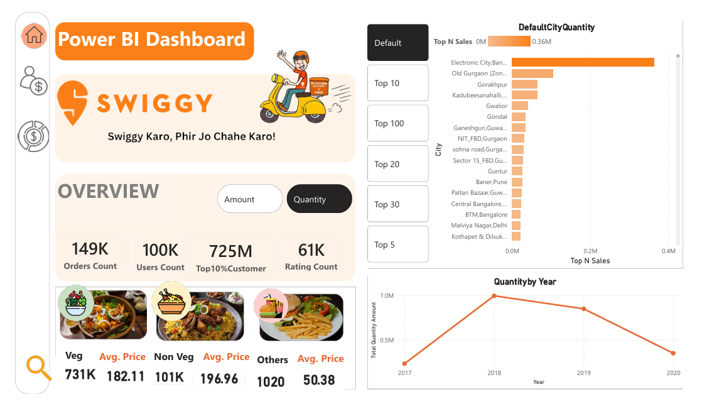
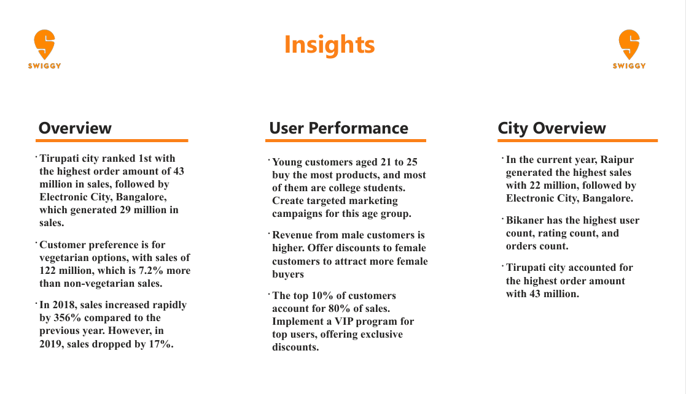

# 📊 Power BI Food Delivery Analytics Dashboard

## 📌 Project Overview
This project presents an interactive Power BI dashboard designed to analyze food delivery data and extract meaningful business insights. The dashboard focuses on sales performance, customer behavior, city-wise trends, and restaurant-level analysis to support data-driven decision-making.

## 🎯 Objectives
- Analyze overall sales and order trends across multiple cities  
- Identify high-performing cities and restaurants  
- Understand customer demographics and purchasing behavior  
- Compare food category performance (Veg vs Non-Veg)  
- Deliver actionable insights for business growth  

## 📈 Key Insights
- Tirupati leads in total order value with 43M  
- Raipur ranks highest in current-year sales with 22M  
- The 21–25 age group contributes the highest number of orders  
- Top 10% of customers generate approximately 80% of total revenue  
- Vegetarian food has higher demand compared to non-vegetarian items  
- Sales peaked in 2018, followed by a decline in 2019  

## 🛠 Tools & Technologies
- Power BI Desktop  
- DAX (Data Analysis Expressions)  
- Data Modeling  
- Data Cleaning and Transformation  
- Data Visualization  

## 📊 Dashboard Features
- Interactive KPI cards for sales, orders, ratings, and user count  
- Dynamic slicers for Year, Gender, City, and Top-N analysis  
- City-wise sales and performance analysis  
- Customer segmentation by age, gender, and occupation  
- Year-over-year trend analysis  

## 🖼 Dashboard Screenshots

### Overview

### City Overview

### User Performance

### Restaurant Analysis

### Insights

## 🚀 Learnings
- Built an end-to-end Power BI solution from raw data to insights  
- Strengthened DAX and data modeling skills  
- Improved data storytelling and dashboard design  
- Gained hands-on experience with business analytics  

## 👤 Author
Ashish Pal  
Email: your-ashishpal.techie@gmail.com  
LinkedIn: your-linkedin-profile-url  
GitHub: https://github.com/apal27983-cpu  

## ⭐ Feedback
If you found this project useful, feel free to star the repository or share your feedback.
